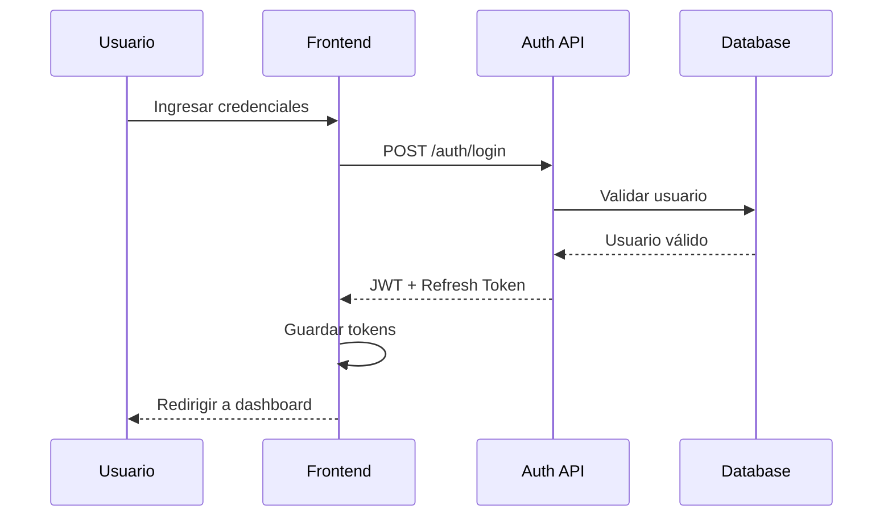
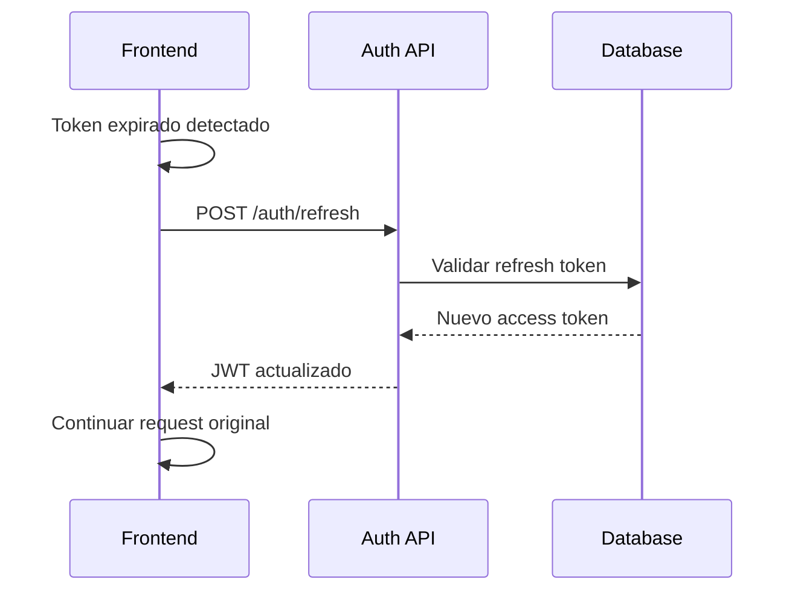

# 🔐 Sistema de Autenticación - Triboka Agro Frontend

**Versión:** 1.0.0
**Fecha:** 14 de noviembre de 2025

---

## 📋 Tabla de Contenidos

1. [Visión General](#visión-general)
2. [Arquitectura de Autenticación](#arquitectura-de-autenticación)
3. [Flujo de Login](#flujo-de-login)
4. [Gestión de Tokens](#gestión-de-tokens)
5. [Roles y Permisos](#roles-y-permisos)
6. [Seguridad](#seguridad)
7. [Persistencia de Sesión](#persistencia-de-sesión)
8. [Logout y Limpieza](#logout-y-limpieza)

---

## 🎯 Visión General

El sistema de autenticación de Triboka Agro implementa JWT (JSON Web Tokens) con refresh tokens para mantener sesiones seguras y stateless. Soporta múltiples roles de usuario con permisos granulares y configuración dinámica de la interfaz según el rol.

---

## 🏗️ Arquitectura de Autenticación

### Componentes Principales

```
┌─────────────────────────────────────┐
│         Frontend (Next.js)          │
├─────────────────────────────────────┤
│         Auth Store (Zustand)        │
│  - User State                      │
│  - Token Management                │
│  - Role Configuration              │
├─────────────────────────────────────┤
│         Auth Service                │
│  - API Calls                       │
│  - Token Refresh                   │
│  - Error Handling                  │
├─────────────────────────────────────┤
│         HTTP Client (API)           │
│  - Request Interception            │
│  - Token Injection                 │
│  - Response Handling               │
└─────────────────────────────────────┘
```

### Estados de Autenticación

```typescript
enum AuthStatus {
  IDLE = 'idle',
  LOADING = 'loading',
  AUTHENTICATED = 'authenticated',
  UNAUTHENTICATED = 'unauthenticated',
  ERROR = 'error'
}
```

---

## 🔄 Flujo de Login

### Proceso de Autenticación



### Implementación del Login

```typescript
// stores/auth.ts
export const useAuthStore = create<AuthState & AuthActions>()(
  devtools(
    persist(
      (set, get) => ({
        login: async (email: string, password: string) => {
          set({ loading: true, error: null });

          try {
            const { user, tokens } = await authService.login({ email, password });

            set({
              user,
              token: tokens.accessToken,
              refreshToken: tokens.refreshToken,
              isAuthenticated: true,
              loading: false,
            });

            logger.info('User logged in', { userId: user.id, role: user.role });
          } catch (error: any) {
            const errorMessage = error.message || 'Error al iniciar sesión';
            set({ error: errorMessage, loading: false });
            logger.error('Login failed', { error: errorMessage, email });
            throw error;
          }
        },
      }),
      {
        name: 'auth-storage',
        partialize: (state) => ({
          user: state.user,
          token: state.token,
          refreshToken: state.refreshToken,
          isAuthenticated: state.isAuthenticated,
        }),
      }
    ),
    { name: 'auth-store' }
  )
);
```

---

## 🎫 Gestión de Tokens

### Estructura de Tokens

```typescript
interface AuthTokens {
  accessToken: string;
  refreshToken: string;
  expiresIn: number; // segundos
  tokenType: 'Bearer';
}

interface JWTPayload {
  sub: string; // User ID
  email: string;
  role: string;
  permissions: string[];
  iat: number; // Issued at
  exp: number; // Expires at
  iss: string; // Issuer
  aud: string; // Audience
}
```

### Refresh Token Flow



### Implementación de Refresh

```typescript
// services/auth.ts
export class AuthService {
  async refreshToken(): Promise<string> {
    const refreshToken = localStorage.getItem('refreshToken');

    if (!refreshToken) {
      throw new Error('No refresh token available');
    }

    const response = await apiClient.post('/auth/refresh', {
      refreshToken,
    });

    const { accessToken } = response.data;

    // Actualizar token en localStorage
    localStorage.setItem('accessToken', accessToken);

    return accessToken;
  }
}
```

### Intercepción de Requests

```typescript
// lib/api/client.ts
class ApiClient {
  private async request(config: AxiosRequestConfig): Promise<AxiosResponse> {
    // Inyectar token de autorización
    const token = localStorage.getItem('accessToken');
    if (token) {
      config.headers = {
        ...config.headers,
        Authorization: `Bearer ${token}`,
      };
    }

    try {
      return await axios(config);
    } catch (error: any) {
      // Si es error 401, intentar refresh
      if (error.response?.status === 401 && !config._retry) {
        config._retry = true;

        try {
          const newToken = await authService.refreshToken();
          config.headers.Authorization = `Bearer ${newToken}`;
          return await axios(config);
        } catch (refreshError) {
          // Refresh falló, logout forzado
          authStore.logout();
          throw refreshError;
        }
      }

      throw error;
    }
  }
}
```

---

## 👥 Roles y Permisos

### Definición de Roles

```typescript
interface UserRole {
  id: string;
  name: 'admin' | 'producer' | 'exporter' | 'buyer';
  displayName: string;
  description: string;
  permissions: string[];
  features: string[];
  navigation: NavigationItem[];
}
```

### Roles del Sistema

#### Administrador
```typescript
const adminRole: UserRole = {
  id: 'admin',
  name: 'admin',
  displayName: 'Administrador',
  description: 'Control total del sistema',
  permissions: [
    'users.manage',
    'companies.manage',
    'lots.manage',
    'contracts.manage',
    'deals.manage',
    'licenses.manage',
    'support.manage',
    'tickets.manage',
    'api.manage',
    'analytics.view',
    'system.configure',
  ],
  features: [
    'admin_panel',
    'user_management',
    'company_management',
    'global_analytics',
    'system_configuration',
    'license_management',
    'support_system',
    'api_management',
  ],
};
```

#### Productor
```typescript
const producerRole: UserRole = {
  id: 'producer',
  name: 'producer',
  displayName: 'Productor',
  description: 'Gestión de lotes y certificaciones',
  permissions: [
    'lots.create',
    'lots.edit',
    'lots.delete',
    'contracts.create',
    'certifications.manage',
    'payments.view',
  ],
  features: [
    'lot_management',
    'contract_creation',
    'certification_tracking',
    'payment_history',
  ],
};
```

#### Exportador
```typescript
const exporterRole: UserRole = {
  id: 'exporter',
  name: 'exporter',
  displayName: 'Exportador',
  description: 'Compra y gestión de lotes',
  permissions: [
    'marketplace.access',
    'contracts.create',
    'contracts.approve',
    'lots.purchase',
    'analytics.view',
  ],
  features: [
    'marketplace_access',
    'contract_negotiation',
    'purchase_tracking',
    'business_analytics',
  ],
};
```

#### Comprador
```typescript
const buyerRole: UserRole = {
  id: 'buyer',
  name: 'buyer',
  displayName: 'Comprador',
  description: 'Búsqueda y compra de lotes',
  permissions: [
    'marketplace.access',
    'lots.search',
    'contracts.create',
    'favorites.manage',
  ],
  features: [
    'advanced_search',
    'purchase_history',
    'favorites_system',
    'contract_management',
  ],
};
```

### Control de Acceso

```typescript
// hooks/useRoleAccess.ts
export function useRoleAccess() {
  const { user } = useAuthStore();

  const hasPermission = useCallback((permission: string) => {
    if (!user) return false;
    return hasRolePermission(user.role, permission);
  }, [user]);

  const hasFeature = useCallback((feature: string) => {
    if (!user) return false;
    return hasRoleFeature(user.role, feature);
  }, [user]);

  return {
    hasPermission,
    hasFeature,
    isAdmin: user?.role === 'admin',
    isProducer: user?.role === 'producer',
    isExporter: user?.role === 'exporter',
    isBuyer: user?.role === 'buyer',
  };
}
```

---

## 🔒 Seguridad

### Medidas de Seguridad Implementadas

#### Encriptación
- **HTTPS Obligatorio**: Todas las comunicaciones encriptadas
- **JWT Firmados**: Tokens firmados con algoritmo HS256
- **Hashing de Passwords**: bcrypt con salt rounds altos

#### Validaciones
```typescript
// Validación de input
const loginSchema = z.object({
  email: z.string().email('Email inválido'),
  password: z.string().min(8, 'Mínimo 8 caracteres'),
});

// Rate limiting
const loginLimiter = {
  windowMs: 15 * 60 * 1000, // 15 minutos
  max: 5, // 5 intentos por ventana
  message: 'Demasiados intentos de login',
};
```

#### Protección contra Ataques Comunes
- **SQL Injection**: Parametrized queries
- **XSS**: Sanitización de inputs
- **CSRF**: Tokens anti-CSRF
- **Brute Force**: Rate limiting y CAPTCHA

### Auditoría

```typescript
interface AuditLog {
  id: string;
  userId: string;
  action: string;
  resource: string;
  timestamp: string;
  ipAddress: string;
  userAgent: string;
  metadata?: any;
}
```

**Acciones Auditadas:**
- Login/logout
- Cambios de contraseña
- Modificaciones de perfil
- Creación/edición de lotes
- Aprobación de contratos

---

## 💾 Persistencia de Sesión

### Almacenamiento Local

```typescript
// Configuración de persistencia
const authPersistConfig = {
  name: 'auth-storage',
  partialize: (state) => ({
    user: state.user,
    token: state.token,
    refreshToken: state.refreshToken,
    isAuthenticated: state.isAuthenticated,
  }),
};
```

### Sincronización entre Pestañas

```typescript
// lib/stateSync.ts
export function useCrossTabState<T>(
  key: string,
  initialValue: T
) {
  const [state, setState] = useLocalStorage(key, initialValue);
  const { postMessage } = useBroadcastChannel<T>(`state-${key}`, (data) => {
    setState(data);
  });

  const updateState = useCallback((newValue: T | ((prev: T) => T)) => {
    setState((prev) => {
      const value = typeof newValue === 'function' ? (newValue as Function)(prev) : newValue;
      postMessage(value);
      return value;
    });
  }, [setState, postMessage]);

  return [state, updateState] as const;
}
```

### Tiempo de Vida de Sesión

```typescript
const SESSION_CONFIG = {
  accessTokenExpiry: 15 * 60 * 1000,     // 15 minutos
  refreshTokenExpiry: 7 * 24 * 60 * 60 * 1000, // 7 días
  inactivityTimeout: 30 * 60 * 1000,    // 30 minutos
  rememberMeExpiry: 30 * 24 * 60 * 60 * 1000, // 30 días
};
```

---

## 🚪 Logout y Limpieza

### Logout Manual

```typescript
// stores/auth.ts
logout: async () => {
  set({ loading: true });

  try {
    await authService.logout();
  } catch (error) {
    logger.warn('Logout API call failed', { error: error.message });
  } finally {
    set({
      user: null,
      token: null,
      refreshToken: null,
      isAuthenticated: false,
      loading: false,
      error: null,
    });

    // Limpiar localStorage
    localStorage.removeItem('accessToken');
    localStorage.removeItem('refreshToken');

    logger.info('User logged out');
  }
},
```

### Logout Automático

```typescript
// hooks/useAutoLogout.ts
export function useAutoLogout() {
  const { logout } = useAuthStore();

  useEffect(() => {
    let inactivityTimer: NodeJS.Timeout;

    const resetTimer = () => {
      clearTimeout(inactivityTimer);
      inactivityTimer = setTimeout(() => {
        logger.info('Auto logout due to inactivity');
        logout();
      }, SESSION_CONFIG.inactivityTimeout);
    };

    const events = ['mousedown', 'mousemove', 'keypress', 'scroll', 'touchstart'];

    events.forEach(event => {
      document.addEventListener(event, resetTimer, true);
    });

    resetTimer();

    return () => {
      clearTimeout(inactivityTimer);
      events.forEach(event => {
        document.removeEventListener(event, resetTimer, true);
      });
    };
  }, [logout]);
}
```

### Limpieza de Sesión Expirada

```typescript
// utils/sessionCleanup.ts
export function cleanupExpiredSession() {
  const token = localStorage.getItem('accessToken');
  const refreshToken = localStorage.getItem('refreshToken');

  if (!token || !refreshToken) {
    // No hay tokens, limpiar todo
    clearAuthData();
    return;
  }

  try {
    const payload = JSON.parse(atob(token.split('.')[1]));
    const isExpired = payload.exp * 1000 < Date.now();

    if (isExpired) {
      clearAuthData();
    }
  } catch (error) {
    // Token inválido, limpiar
    clearAuthData();
  }
}

function clearAuthData() {
  localStorage.removeItem('accessToken');
  localStorage.removeItem('refreshToken');
  // Limpiar store
  useAuthStore.setState({
    user: null,
    token: null,
    refreshToken: null,
    isAuthenticated: false,
  });
}
```

---

## 🔍 Monitoreo y Debugging

### Logging de Autenticación

```typescript
// lib/logger.ts
export const authLogger = {
  login: (userId: string, role: string) => {
    logger.info('User login successful', { userId, role });
  },

  loginFailed: (email: string, reason: string) => {
    logger.warn('Login failed', { email, reason });
  },

  logout: (userId: string) => {
    logger.info('User logout', { userId });
  },

  tokenRefresh: (userId: string) => {
    logger.debug('Token refreshed', { userId });
  },

  unauthorized: (endpoint: string, userId?: string) => {
    logger.warn('Unauthorized access attempt', { endpoint, userId });
  },
};
```

### Debugging en Desarrollo

```typescript
// Debug panel para desarrollo
export function AuthDebugPanel() {
  const auth = useAuthStore();

  if (process.env.NODE_ENV !== 'development') return null;

  return (
    <div className="fixed bottom-4 right-4 bg-white p-4 border rounded shadow-lg">
      <h3 className="font-bold mb-2">Auth Debug</h3>
      <pre className="text-xs">
        {JSON.stringify({
          isAuthenticated: auth.isAuthenticated,
          user: auth.user ? { id: auth.user.id, role: auth.user.role } : null,
          hasToken: !!auth.token,
          hasRefreshToken: !!auth.refreshToken,
        }, null, 2)}
      </pre>
    </div>
  );
}
```

---

## 📈 Métricas de Seguridad

### KPIs de Autenticación
- **Tasa de Éxito de Login**: > 98%
- **Tiempo Promedio de Login**: < 2 segundos
- **Intentos de Login Fallidos**: Monitoreados
- **Sesiones Activas**: Dashboard en tiempo real

### Alertas de Seguridad
- Múltiples intentos fallidos desde misma IP
- Login desde ubicación inusual
- Cambios de contraseña frecuentes
- Acceso a recursos no autorizados

---

*El sistema de autenticación está diseñado para ser seguro, escalable y fácil de mantener, proporcionando una base sólida para la gestión de usuarios en Triboka Agro.*