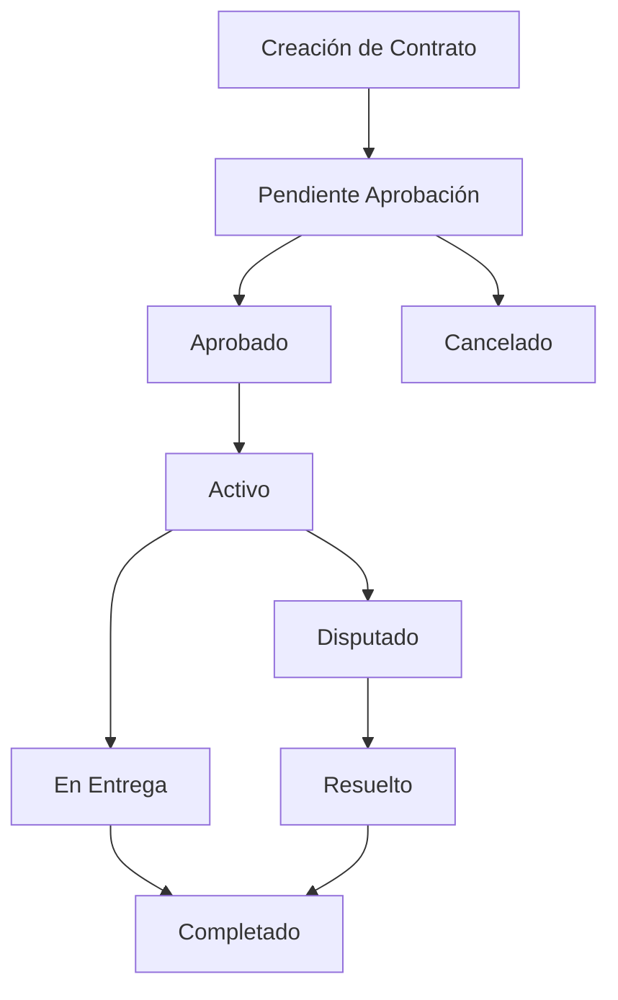

# 🎯 Funcionalidades Core - Triboka Agro Frontend

**Versión:** 1.0.0
**Fecha:** 14 de noviembre de 2025

---

## 📋 Tabla de Contenidos

1. [Visión General](#visión-general)
2. [Dashboard Principal](#dashboard-principal)
3. [Gestión de Lotes](#gestión-de-lotes)
4. [Sistema de Contratos](#sistema-de-contratos)
5. [Integración Blockchain](#integración-blockchain)
6. [Analytics y Reportes](#analytics-y-reportes)
7. [Sistema de Usuarios](#sistema-de-usuarios)
8. [Configuración por Roles](#configuración-por-roles)

---

## 🎯 Visión General

Las funcionalidades core del frontend Triboka Agro están diseñadas para proporcionar una experiencia completa de gestión de lotes de cacao con trazabilidad blockchain integrada. El sistema soporta múltiples roles de usuario con funcionalidades específicas para cada uno.

---

## 📊 Dashboard Principal

### Características Generales
- **Vista Personalizada por Rol**: Dashboard adaptado según el rol del usuario
- **Métricas en Tiempo Real**: KPIs actualizados dinámicamente
- **Navegación Contextual**: Sidebar con opciones específicas por rol
- **Responsive Design**: Optimizado para desktop, tablet y móvil

### Dashboard por Rol

#### Dashboard de Productor
```typescript
const producerMetrics = {
  totalLotes: 45,
  lotesActivos: 32,
  lotesVendidos: 13,
  certificacionesActivas: 28,
  contratosPendientes: 5,
  ingresosMes: 125000,
  promedioCalidad: 92
};
```

**Funcionalidades:**
- Vista general de lotes activos
- Estado de certificaciones
- Contratos pendientes de aprobación
- Tendencias de precios
- Alertas de calidad

#### Dashboard de Exportador
```typescript
const exporterMetrics = {
  lotesComprados: 156,
  contratosActivos: 23,
  volumenTotal: 45000, // kg
  proveedoresActivos: 12,
  calidadPromedio: 89,
  cumplimientoEntregas: 98,
  margenBeneficio: 15.5
};
```

**Funcionalidades:**
- Marketplace de lotes disponibles
- Seguimiento de contratos
- Gestión de proveedores
- Analytics de compras
- Control de calidad

#### Dashboard de Administrador
```typescript
const adminMetrics = {
  usuariosTotales: 1250,
  usuariosActivos: 892,
  lotesSistema: 3456,
  contratosActivos: 234,
  volumenTotal: 1250000, // kg
  transaccionesMes: 456,
  uptimeSistema: 99.9,
  ticketsPendientes: 12
};
```

**Funcionalidades:**
- Supervisión global del sistema
- Gestión de usuarios y empresas
- Deal Room para negociaciones
- Analytics del sistema completo
- Gestión de soporte técnico

#### Dashboard de Comprador
```typescript
const buyerMetrics = {
  busquedasRealizadas: 45,
  lotesFavoritos: 12,
  contratosIniciados: 8,
  comprasRealizadas: 23,
  presupuestoRestante: 50000,
  proveedoresPreferidos: 5
};
```

**Funcionalidades:**
- Búsqueda avanzada de lotes
- Sistema de favoritos
- Historial de compras
- Alertas de nuevos lotes
- Gestión de presupuesto

---

## 🌱 Gestión de Lotes

### Creación de Lotes
```typescript
interface LotData {
  name: string;
  description?: string;
  weight: number;
  unit: 'kg' | 'ton' | 'lb';
  quality: 'premium' | 'standard' | 'basic';
  location: string;
  harvestDate: string;
  certifications?: string[];
  metadata: {
    variedad: string;
    altitud: number;
    proceso: string;
    notasCata: string;
  };
}
```

**Proceso de Creación:**
1. **Registro Básico**: Nombre, peso, calidad, ubicación
2. **Metadatos Agrícolas**: Variedad, altitud, proceso de fermentación
3. **Certificaciones**: Orgánico, comercio justo, etc.
4. **Documentación**: Fotos, análisis de laboratorio
5. **Validación**: Verificación de datos y creación en blockchain

### Estados de Lotes
```typescript
enum LotStatus {
  DRAFT = 'draft',           // Borrador
  PENDING_VALIDATION = 'pending_validation', // Pendiente validación
  VALIDATED = 'validated',   // Validado
  AVAILABLE = 'available',   // Disponible para venta
  RESERVED = 'reserved',     // Reservado
  SOLD = 'sold',            // Vendido
  DELIVERED = 'delivered',   // Entregado
  CANCELLED = 'cancelled'   // Cancelado
}
```

### Compartir Lotes
```typescript
interface LotShare {
  lotId: string;
  sharedWith: string[]; // IDs de usuarios
  permissions: {
    view: boolean;
    edit: boolean;
    share: boolean;
    download: boolean;
  };
  expiresAt?: string;
  message?: string;
}
```

**Permisos de Compartir:**
- **Vista**: Solo lectura del lote
- **Edición**: Modificar información del lote
- **Compartir**: Reenviar a otros usuarios
- **Descarga**: Descargar certificados y documentos

---

## 📄 Sistema de Contratos

### Tipos de Contratos
```typescript
enum ContractType {
  SPOT = 'spot',           // Compra inmediata
  FORWARD = 'forward',     // Contrato a futuro
  FRAMEWORK = 'framework', // Acuerdo marco
  OPTION = 'option'        // Opción de compra
}
```

### Estados de Contratos
```typescript
enum ContractStatus {
  DRAFT = 'draft',
  PENDING_APPROVAL = 'pending_approval',
  APPROVED = 'approved',
  ACTIVE = 'active',
  IN_DELIVERY = 'in_delivery',
  COMPLETED = 'completed',
  CANCELLED = 'cancelled',
  DISPUTED = 'disputed'
}
```

### Flujo de Contrato


### Deal Room
**Funcionalidad para Administradores:**
- Facilitar negociaciones entre productores y exportadores
- Chat en tiempo real
- Compartir documentos
- Historial de ofertas
- Aprobación final de contratos

---

## ⛓️ Integración Blockchain

### Certificación Automática
```typescript
interface BlockchainCertificate {
  lotId: string;
  producerId: string;
  timestamp: string;
  hash: string;
  metadata: {
    quality: number;
    certifications: string[];
    location: string;
    harvestDate: string;
  };
  transactionId: string;
  blockNumber: number;
}
```

### Trazabilidad Completa
```typescript
interface TraceabilityRecord {
  id: string;
  lotId: string;
  type: 'harvest' | 'processing' | 'transport' | 'storage' | 'sale';
  timestamp: string;
  location: string;
  actor: string; // ID del usuario/compañía
  data: any; // Datos específicos del evento
  hash: string;
  previousHash: string;
}
```

### Verificación de Autenticidad
- **QR Codes**: En certificados físicos
- **Blockchain Explorer**: Verificación pública
- **API de Verificación**: Para terceros
- **Certificados Descargables**: PDF con QR

---

## 📊 Analytics y Reportes

### Métricas por Rol

#### Analytics de Productor
- Rendimiento por lote
- Tendencias de precios
- Calidad promedio
- Certificaciones activas
- Historial de ventas

#### Analytics de Exportador
- Volumen de compras
- Proveedores más activos
- Margen de beneficio
- Cumplimiento de entregas
- Tendencias de mercado

#### Analytics de Administrador
- Usuarios activos
- Volumen total del sistema
- Transacciones por día
- Tickets de soporte
- Uptime del sistema

### Reportes Exportables
```typescript
interface ReportConfig {
  type: 'pdf' | 'excel' | 'csv';
  dateRange: {
    start: string;
    end: string;
  };
  filters: {
    lots?: string[];
    users?: string[];
    contracts?: string[];
  };
  metrics: string[];
}
```

---

## 👥 Sistema de Usuarios

### Roles y Permisos
```typescript
interface UserRole {
  id: string;
  name: string;
  displayName: string;
  permissions: string[];
  features: string[];
  limits: {
    maxLots?: number;
    maxContracts?: number;
    apiCallsPerHour?: number;
  };
}
```

### Gestión de Perfiles
```typescript
interface UserProfile {
  id: string;
  email: string;
  name: string;
  role: string;
  company?: string;
  avatar?: string;
  location?: string;
  certifications?: string[];
  preferences: {
    language: string;
    notifications: boolean;
    theme: 'light' | 'dark' | 'system';
  };
}
```

### Autenticación y Seguridad
- **JWT Tokens**: Autenticación stateless
- **Refresh Tokens**: Renovación automática
- **2FA**: Autenticación de dos factores (planeado)
- **Session Management**: Control de sesiones activas

---

## 🔐 Configuración por Roles

### Configuración de Admin
- **Sistema**: Configuración global, límites, APIs
- **Usuarios**: Gestión de roles y permisos
- **Empresas**: Aprobación y configuración
- **Licencias**: Gestión de licencias de uso
- **Soporte**: Configuración del sistema de tickets

### Configuración de Producer
- **Perfil**: Información personal y de finca
- **Certificaciones**: Preferencias y renovaciones
- **Pagos**: Métodos de pago y facturación
- **Notificaciones**: Alertas de mercado y contratos

### Configuración de Exporter
- **Empresa**: Perfil corporativo y contactos
- **Compras**: Preferencias de calidad y volumen
- **Envíos**: Configuración logística
- **Proveedores**: Red de proveedores preferidos

### Configuración de Buyer
- **Perfil**: Información personal y preferencias
- **Búsqueda**: Filtros guardados y alertas
- **Compras**: Historial y métodos de pago
- **Presupuesto**: Límites y control de gastos

---

## 📈 Próximas Funcionalidades

### Planificadas para v1.1.0
- **Mobile App**: Aplicación nativa para iOS/Android
- **IA Predictiva**: Análisis de calidad con machine learning
- **IoT Integration**: Sensores para monitoreo en tiempo real
- **P2P Marketplace**: Mercado peer-to-peer avanzado
- **API Pública**: Para integraciones de terceros

### Mejoras Continuas
- **Performance**: Optimización de carga y renderizado
- **UX**: Mejoras basadas en feedback de usuarios
- **Analytics**: Métricas más detalladas y predictivas
- **Seguridad**: Mejoras continuas en seguridad

---

*Esta documentación describe las funcionalidades core implementadas en la versión actual del sistema Triboka Agro.*